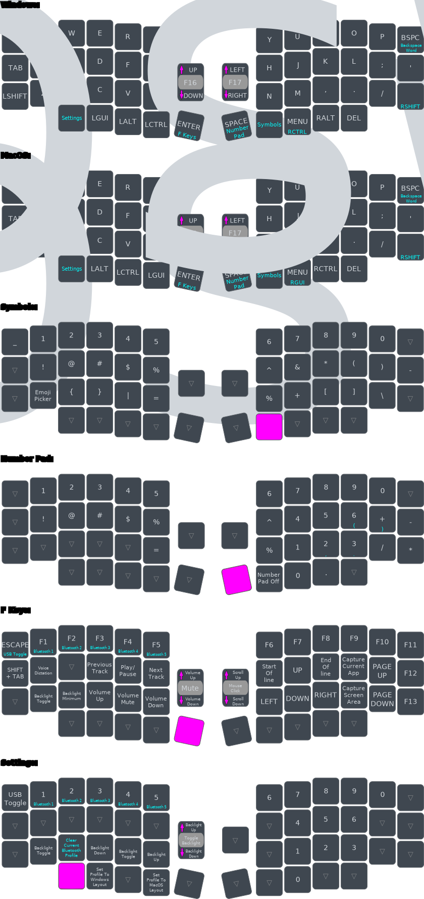

# RolioFirmware
Firmware for the Rolio split wireless keyboard

# How To Install/Flash Firmware To Your Rolio

# What Are Layers

Layers allow a keyboard to have more functions than physical keys. Even if you use a conventional keyboard you will be using layers on a day to day basis.

The "Shift Key" is a great example. When you want to type the "@" symbol you hold "Shift + 2", if you want to type the "<" symbol you hold "Shift + comma". In this regard you can think of the "Shift" key as activating an extra symbols and capitals layer on a conventional keyboard.

Those that use more compact keyboards or laptops may also be familiar with the "fn" key, this can be though of as activating a function keys layer.

The Rolio46 has a few more layers than a regular keyboard. This is done to keep the size down but also (and more importantly) to improve productivity & ergonomics over that of a regular keyboard layout.

# About the Keymap

The rolio46 comes with a built in set of layouts (and layeres) for Windows & MacOS. You can use [ZMK Studio](https://zmk.studio/download) to customise these layouts any time, or if you're adventurous you can clone this repository & edit the keymap file to make far more advanced customisations.

To interpret the diagrams below use the following rules:
 * If text is in teal then you need to hold the key down to make the key do whatever the teal text says.
 * To activate a given layer (Symbols, NumberPad etc) hold down the button highlighted in pink.

Special behaviours:
 * **BSPC Key**
    * When this key is tapped it will behave like a normal backspace key
    * When held it will backspace whole words instead
       * For Windows this is CTRL + BSPC
       * For MacOS this is ALT + BSPC
 * **Symbols Key**
    * If you quickly double tap the "Symbols" key it will stay in the number pad layer.
    * To exit the number pad layer tap the "Symbols" key once.
 * **CapsWord Key**
    * If you taps the CapsWord key the next word you type will be in all capitals, once you enter a punctuation symbol your keyboard will exit CapsWord.
    * When in CapsWord mode you can also tap the CapsWord key once to disable it.
    * If you hold down the CapsWord key it will behave like a normal shift key.
 * **Settings Layer**
    * Clear Current Bluetooth Profile
       * You will need to hold this button down for 2 seconds to have an effect
       * This will delete the bonding information for the current bluetooth profile & reenter pairing mode
       * You can see it's worked when the icon at the top right of your display changes to a "gear icon"
    * Set Profile To Windows Layout
       * Tapping this will cause the currently selected profile (bluetooth number or USB) to use the Windows layout for the main layer & also to use Windows bindings for the various shortcut & utility keys.
       * When switching connections your Rolio will rembember the layout you've chosen.
    * Set Profile To MacOS Layout
       * Tapping this will cause the currently selected profile (bluetooth number or USB) to use the MacOS layout for the main layer & also to use Windows bindings for the various shortcut & utility keys.
       * When switching connections your Rolio will rembember the layout you've chosen.

# Keymap Diagrams

*NOTE: These layout diagrams were created using a combination of [Keymap Drawer](https://github.com/caksoylar/keymap-drawer-web) and [Inkscape](https://inkscape.org).*