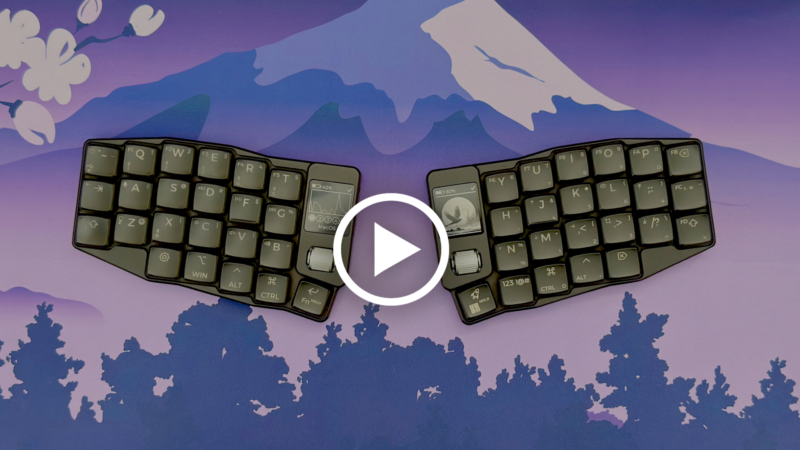

# RolioFirmware
This repository contains the firmware for the Rolio46 split wireless keyboard.

You can view a demo of its features in the video below:

If you'd like to build your own Rolio46 you can find resources at the following two links:
 * [Rolio46 Github](https://github.com/MickiusMousius/Rolio46Keyboard) - All the reousurces to build your own PCBs etc
 * [Keydio.io](https://keydio.io) - Online store to buy a complete kit or just some parts to build your own Rolio46

 

# How To Install/Flash Firmware To Your Rolio
This repository will produce firmware for the following controller & display combinations with the Rolio46:
 * Supported Displays
    * Vista508
    * Vista272 / nice!view
 * Supported Controllers
   * nice!nano / ProMicro NRF52840
   * Mikoto 7.20

You should hopefully be able to infer what files inside the release zip each mean.

To flash your Rolio46 use the following steps:
 1. Plug your right hand side Rolio into your computer.
 2. Quickly double press the reset button.
 3. You should now see a removable drive appear in your file explorer. If not try double pressing reset again and also verify your USB connection.
 4. Drag and drop the appropriate UF2 file to your Rolio's firmware volume & wait for it to finish copying.
 5. Repeat the process for the left hand side.
 6. Once the left side is successfully flashed the right side should inidicate that it has paired to the left.

Notes:
 * If you encounter pairing issues you may need to load a "reset firmware" onto your board. You can follow the above process but substitute the "settings reset" UF2 for the controller you are using.
 * Flashing the right hand side & then the left side seems to produce more consistent results (or has done so in the past, ZMK updates show constant improvements).
  * More information about flashing SMK can be found here: [ZMK Flashing Issues](https://zmk.dev/docs/troubleshooting/flashing-issues)

 

# What Are Layers

Layers allow a keyboard to have more functions than physical keys. Even if you use a conventional keyboard you will be using layers on a day to day basis.

The "Shift Key" is a great example. When you want to type the "@" symbol you hold "Shift + 2", if you want to type the "<" symbol you hold "Shift + comma". In this regard you can think of the "Shift" key as activating an extra symbols and capitals layer on a conventional keyboard.

Those that use more compact keyboards or laptops may also be familiar with the "fn" key, this can be though of as activating a function keys layer.

The Rolio46 has a few more layers than a regular keyboard. This is done to keep the size down but also (and more importantly) to improve productivity & ergonomics over that of a regular keyboard layout.

 

# About The Key Map

The Rolio46 comes with a built in set of layouts (and layers) for Windows & MacOS. You can use [ZMK Studio](https://zmk.studio/download) to customise these layouts any time, or if you're adventurous you can clone this repository & edit the keymap file to make far more advanced customisations.

To interpret the diagrams below use the following rules:
 * If text is in **${\color{#00FFFF}Aqua\ Blue}$** then you need to hold the key down to make the key do whatever the **${\color{#00FFFF}Aqua\ Blue}$** text says.
 * To activate a given layer (Symbols, NumberPad etc) hold down the button highlighted in **${\color{#FF00FF}Pink}$**.
 * The keys marked with a small faded triangle will not change their behaviour when you change layer.

Special behaviours:
 * **BSPC Key**
    * When this key is tapped it will behave like a normal backspace key
    * When held it will backspace whole words instead
       * For Windows this is CTRL + BSPC
       * For MacOS this is ALT + BSPC
 * **Symbols Key**
    * If you quickly double tap the "Symbols" key it will stay in the number pad layer.
    * To exit the number pad layer tap the "Symbols" key once.
 * **CapsWord Key**
    * If you taps the CapsWord key the next word you type will be in all capitals, once you enter a punctuation symbol your keyboard will exit CapsWord.
    * When in CapsWord mode you can also tap the CapsWord key once to disable it.
    * If you hold down the CapsWord key it will behave like a normal shift key.
 * **Settings Layer**
    * Clear Current Bluetooth Profile
       * You will need to hold this button down for 2 seconds to have an effect
       * This will delete the bonding information for the current bluetooth profile & reenter pairing mode
       * You can see it's worked when the icon at the top right of your display changes to a "gear icon"
    * Set Profile To Windows Layout
       * Tapping this will cause the currently selected profile (bluetooth number or USB) to use the Windows layout for the main layer & also to use Windows bindings for the various shortcut & utility keys.
       * When switching connections your Rolio will remember the layout you've chosen.
    * Set Profile To MacOS Layout
       * Tapping this will cause the currently selected profile (bluetooth number or USB) to use the MacOS layout for the main layer & also to use MacOS bindings for the various shortcut & utility keys.
       * When switching connections your Rolio will remember the layout you've chosen.

 

# Keymap Diagrams

*NOTE: These layout diagrams were created using a combination of [Keymap Drawer](https://github.com/caksoylar/keymap-drawer-web) and [Inkscape](https://inkscape.org).*